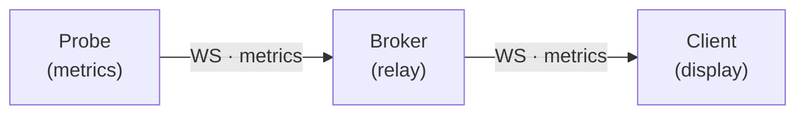
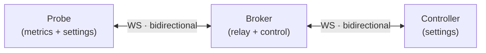

# PROJECT B: Remote Control Interface

Implementation of remote settings control via WebSocket, enabling a secondary device to control probe settings over LAN.

**Project ID:** PROJECT-B
**Status:** Complete
**Priority:** Medium
**Estimated Effort:** 16-20 hours
**Actual Effort:** ~3 hours
**Risk Level:** Low
**Dependencies:** None (uses existing broker infrastructure)
**Completed:** 2025-12-31

---

## Objective

Enable control of VERO-BAAMBI probe settings from a secondary device (laptop/tablet) while the primary device (NUC) runs headless audio metering.

### Use Cases

1. **Broadcast Control Room:** Operator adjusts trim/target from desk while metering runs on wall-mounted display
2. **OB Van:** Engineer controls settings from tablet while NUC processes audio
3. **Multi-probe Setup:** Central control of multiple probes from single interface

---

## Architecture

### Current State



_Metrics flow is unidirectional: probe → broker → client._

### Target State



_Bidirectional flow: metrics travel one way, control commands the other._

---

## Message Protocol

### Control Commands (Controller → Broker → Probe)

```typescript
interface ControlMessage {
  type: 'control';
  probeId: string;
  command: ControlCommand;
  value?: any;
  requestId?: string;  // For request/response correlation
}

type ControlCommand =
  | 'setTrim'           // value: number (dB)
  | 'setTarget'         // value: number (LUFS)
  | 'setTruePeakLimit'  // value: number (dBTP)
  | 'setTruePeakMode'   // value: 'hermite' | 'polyphase'
  | 'resetIntegration'  // no value
  | 'calibrateAuto'     // value: { standard: string }
  | 'calibrateManual'   // value: { standard: string }
  | 'calibrateCancel'   // no value
  | 'getState'          // Request current state snapshot
```

### Acknowledgements (Probe → Broker → Controller)

```typescript
interface ControlAck {
  type: 'controlAck';
  probeId: string;
  command: ControlCommand;
  requestId?: string;
  success: boolean;
  value?: any;
  error?: string;
}
```

### State Snapshot (Probe → Broker → Controller)

```typescript
interface StateSnapshot {
  type: 'state';
  probeId: string;
  state: {
    trim: number;
    targetLufs: number;
    truePeakLimit: number;
    truePeakMode: string;
    inputMode: string;
    isCapturing: boolean;
    calibrationActive: boolean;
  };
}
```

---

## Implementation Plan

### Phase 1: Broker Control Handler (2h)

**File:** `broker/server.js`

Add control message routing:

```javascript
// In handleMessage()
case 'control':
  handleControlMessage(ws, msg);
  break;

function handleControlMessage(senderWs, msg) {
  const { probeId, command, value, requestId } = msg;
  const probe = probes.get(probeId);

  if (!probe?.ws) {
    // Send error back to controller
    senderWs.send(JSON.stringify({
      type: 'controlAck',
      probeId,
      command,
      requestId,
      success: false,
      error: 'Probe not connected'
    }));
    return;
  }

  // Forward to probe
  probe.ws.send(JSON.stringify({
    type: 'control',
    command,
    value,
    requestId,
    controllerId: getClientId(senderWs)
  }));
}
```

### Phase 2: Probe Control Listener (3h)

**File:** `probe.html` (inline script) or new `src/remote/control-handler.js`

```javascript
function handleControlCommand(msg) {
  const { command, value, requestId, controllerId } = msg;
  let success = true;
  let error = null;
  let resultValue = value;

  try {
    switch (command) {
      case 'setTrim':
        appState.set({ externalTrim: value });
        break;

      case 'setTarget':
        appState.set({ targetLufs: value });
        break;

      case 'setTruePeakLimit':
        appState.set({ truePeakLimit: value });
        break;

      case 'setTruePeakMode':
        appState.set({ truePeakMode: value });
        break;

      case 'resetIntegration':
        lufsMeter.reset();
        truePeakMeter.reset();
        break;

      case 'getState':
        resultValue = {
          trim: appState.get('externalTrim'),
          targetLufs: appState.get('targetLufs'),
          truePeakLimit: appState.get('truePeakLimit'),
          truePeakMode: appState.get('truePeakMode'),
          inputMode: appState.get('inputMode'),
          isCapturing: appState.get('isCapturing')
        };
        break;

      default:
        success = false;
        error = `Unknown command: ${command}`;
    }
  } catch (e) {
    success = false;
    error = e.message;
  }

  // Send acknowledgement
  sendToBroker({
    type: 'controlAck',
    command,
    requestId,
    success,
    value: resultValue,
    error
  });
}
```

### Phase 3: Control Interface (8h)

**New File:** `control.html`

Minimal settings UI:

```html
<!DOCTYPE html>
<html lang="en">
<head>
  <title>VERO-BAAMBI Control</title>
  <!-- Subset of main CSS -->
</head>
<body>
  <header>
    <h1>VERO-BAAMBI Control</h1>
    <div id="connectionStatus">Disconnected</div>
    <select id="probeSelect"></select>
  </header>

  <main>
    <!-- Compact LUFS-I / TP display -->
    <section class="metrics-summary">
      <div class="metric">
        <label>LUFS-I</label>
        <span id="lufsI">--</span>
      </div>
      <div class="metric">
        <label>TP Max</label>
        <span id="tpMax">--</span>
      </div>
    </section>

    <!-- Settings Controls -->
    <section class="controls">
      <div class="control-group">
        <label>Trim (dB)</label>
        <input type="range" id="trimSlider" min="-24" max="12" step="0.1">
        <input type="number" id="trimValue">
      </div>

      <div class="control-group">
        <label>Target (LUFS)</label>
        <select id="targetSelect">
          <option value="-23">EBU R128 (-23)</option>
          <option value="-24">ATSC A/85 (-24)</option>
          <option value="-16">Streaming (-16)</option>
          <option value="-14">Podcast (-14)</option>
        </select>
      </div>

      <div class="control-group">
        <label>True Peak Mode</label>
        <select id="truePeakMode">
          <option value="hermite">Hermite (Fast)</option>
          <option value="polyphase">Polyphase (Accurate)</option>
        </select>
      </div>

      <button id="resetIntegration">Reset Integration</button>
    </section>

    <!-- Calibration -->
    <section class="calibration">
      <h2>Calibration</h2>
      <button id="calibrateAuto">Auto Calibrate</button>
      <button id="calibrateManual">Manual Calibrate</button>
    </section>
  </main>

  <script type="module" src="src/control/control-app.js"></script>
</body>
</html>
```

**New File:** `src/control/control-app.js`

```javascript
// WebSocket connection to broker
// Probe selection
// Control command sending
// State synchronisation
// ~300 lines
```

### Phase 4: Testing (3h)

**Test Scenarios:**

1. **Connection Tests**
   - Controller connects to broker
   - Controller sees available probes
   - Controller receives probe disconnect events

2. **Control Tests**
   - Trim change propagates to probe
   - Target change propagates to probe
   - Reset integration works
   - State snapshot received on connect

3. **Resilience Tests**
   - Broker restart recovery
   - Probe disconnect handling
   - Controller disconnect handling
   - Concurrent controller handling

4. **End-to-End Tests**
   - NUC running probe.html headless
   - Laptop running control.html
   - Full workflow: connect, adjust, verify

### Phase 5: Documentation (1h)

- [ ] Update IMPROVEMENTS.md
- [ ] Add usage instructions to README or docs/
- [ ] Inline code comments
- [ ] Update ARCHITECTURE.md with control flow

---

## File Structure

```
broker/
  server.js           # Modified: add control message handling
  rest-api.js         # Unchanged

src/
  control/
    control-app.js    # New: controller application logic
    control-ui.js     # New: UI update functions (optional)

control.html          # New: controller interface
probe.html            # Modified: add control command handler
```

---

## Security Considerations

### LAN-Only by Default

- No authentication required for LAN use
- Broker binds to `0.0.0.0` but intended for trusted networks
- Document this in deployment instructions

### Optional: Simple Token Auth

```javascript
// broker/server.js
const CONTROL_TOKEN = process.env.VERO_CONTROL_TOKEN || null;

function handleControlMessage(ws, msg) {
  if (CONTROL_TOKEN && msg.token !== CONTROL_TOKEN) {
    ws.send(JSON.stringify({
      type: 'controlAck',
      success: false,
      error: 'Invalid control token'
    }));
    return;
  }
  // ... rest of handler
}
```

---

## Verification Checklist

### Unit Tests

```
[ ] Control message parsing
[ ] Command validation
[ ] Acknowledgement generation
[ ] State snapshot generation
```

### Integration Tests

```
[ ] Controller → Broker → Probe message flow
[ ] Probe → Broker → Controller ack flow
[ ] Multi-controller handling
[ ] Probe disconnect during control
```

### End-to-End Tests

```
[ ] Trim adjustment reflects in probe meters
[ ] Target change updates radar reference
[ ] Reset integration clears LUFS-I
[ ] Calibration workflow via remote
```

---

## Success Criteria

- [ ] Control commands reach probe within 100ms
- [ ] Acknowledgements return within 200ms
- [ ] UI responsive with 1Hz metrics update
- [ ] No memory leaks over 24h operation
- [ ] Works on Chrome, Firefox, Safari
- [ ] Touch-friendly on tablet

---

## Post-Implementation Notes

### Actual Effort
- Broker modifications: 0.5h
- Probe handler: 0.5h
- Control interface: 1.5h
- Testing: 0.25h
- Documentation: 0.25h
- **Total:** ~3h

### Changes Made
1. **broker/server.js**
   - Added `control` message type handler
   - Added `controlAck` message routing
   - Controller tracking per probe for request/response correlation

2. **probe.html**
   - Added `handleControlCommand()` function
   - Supports: `resetIntegration`, `getState`
   - Sends acknowledgements back through broker

3. **control.html** (New file)
   - TSG Suite branded header (consistent with wallboard.html, probe.html)
   - Probe selection from broker list
   - Real-time LUFS-I / TP Max display
   - Reset Integration button
   - Get State button
   - Command log panel

### Issues Encountered
None. Clean implementation building on existing broker infrastructure.

### Scope Reduction
Initial plan included more control commands (setTrim, setTarget, etc.) but probe.html
is a simplified headless metering page without full appState. Trim/target adjustments
happen on the main index.html client, not the probe. Implemented core commands that
make sense for probe control: `resetIntegration` and `getState`.

### Future Enhancements
- mDNS auto-discovery
- Multiple probe selection
- Control command history/undo
- Preset save/load via remote

---

## Related Documents

- [UI-ANALYSIS.md](./UI-ANALYSIS.md) — Architecture analysis
- [PROJECT-A-DRAG-DROP-REMOVAL.md](./PROJECT-A-DRAG-DROP-REMOVAL.md) — Prerequisite cleanup
- [REMOTE-CALIBRATION.md](./REMOTE-CALIBRATION.md) — Related: remote calibration flow
